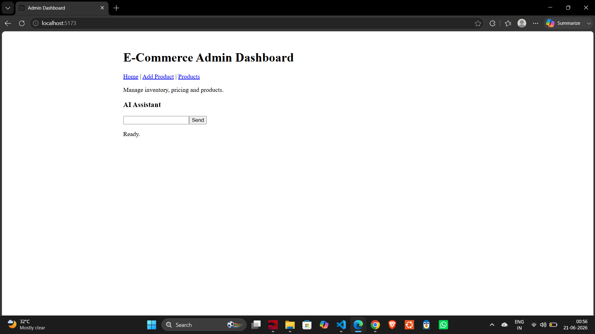
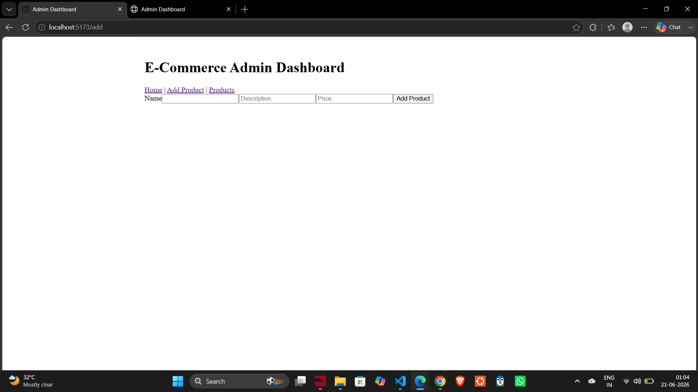

# E-Commerce Admin Dashboard

## Overview

The E-Commerce Admin Dashboard is a React-based Single Page Application (SPA) designed for administrators to manage products in an online store. The application demonstrates modern React development practices, including routing, state management, data fetching, form handling, and AI-assisted user interaction.

This project was built as part of a React Summative Assessment to showcase proficiency in advanced React concepts and frontend application development.

---

## Features

### Product Management

* View all products from a simulated backend
* Add new products using a form
* Update product information such as price
* Search products dynamically

### Routing

* Landing Page
* Add Product Page
* Product Management Page

### State Management

* React Hooks (`useState`, `useEffect`, `useRef`, `useId`)
* Global state management using Context API (`useContext`)
* Custom hooks for reusable logic

### AI Assistant

* AI-powered assistant interface
* Accepts user prompts
* Displays AI-generated responses
* Includes loading and error handling states

### Responsive Design

* Mobile-friendly layout
* Responsive navigation and content sections

---

## Technologies Used

* React
* React Router DOM
* Context API
* Vite
* JSON Server
* React Markdown
* Remark GFM
* Ollama (optional local AI integration)

---

## Project Structure

```text
src/
├── components/
│   ├── AIChat.jsx
│   ├── Navbar.jsx
│   ├── ProductCard.jsx
│   ├── ProductForm.jsx
│   └── ProductList.jsx
├── context/
│   └── ProductContext.jsx
├── hooks/
│   ├── useProducts.js
│   └── useSearch.js
├── pages/
│   ├── Home.jsx
│   ├── Products.jsx
│   └── AddProduct.jsx
├── App.jsx
└── main.jsx
```

---

## Setup Instructions

### 1. Clone the Repository

```bash
git clone https://github.com/your-username/ecommerce-admin-dashboard.git
cd ecommerce-admin-dashboard
```

### 2. Install Dependencies

```bash
npm install
```

### 3. Start the Mock Backend

```bash
npm run server
```

The JSON Server backend will run at:

```text
http://localhost:3001
```

### 4. Start the React Application

```bash
npm run dev
```

The application will run at:

```text
http://localhost:5173
```

---

## Sample Product Data

```json
{
  "id": 1,
  "name": "Coca-Cola",
  "description": "Soft drink",
  "origin": "US",
  "price": 20
}
```

---

## AI Integration

The AI Assistant component is designed to integrate with Ollama or another AI service.

Example Ollama endpoint:

```text
http://localhost:11434/api/generate
```

The assistant accepts user prompts and displays AI-generated responses within the application.

---

## Known Limitations

* AI integration may require a locally running Ollama instance.
* Product deletion functionality can be expanded in future versions.
* Authentication and authorization are not currently implemented.
* Error handling can be enhanced for production use.

---

## Future Improvements

* User authentication and role management
* Product image uploads
* Inventory tracking
* Analytics dashboard
* Product categories and filtering
* Real-time updates

---

## Comments and Code Documentation

Comments have been added throughout the codebase to explain:

* Context Provider logic
* Custom hook implementation
* API request handling
* Routing configuration
* AI assistant workflow

This improves maintainability and readability for future developers.

---

## Screenshots

### Home Page



### Product Management



### AI Assistant


---

## Author

Created as part of the React Summative Assessment.

Developer: Trivekram

GitHub Repository: https://github.com/trivekram-s/admin-dashboard-app-react.git
